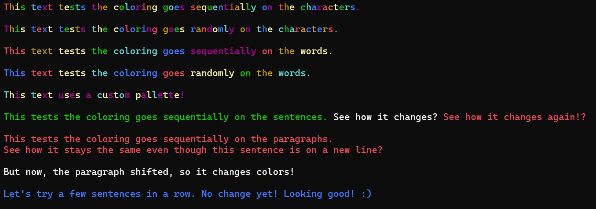

# ShinyConsole

Lightweight console coloring helpers published as the `JMykitta.ShinyConsole` NuGet package.

This repository contains an example project that references the package:
`ShinyConsole.Example\ShinyConsole.Example.csproj`.

## Prerequisites
- .NET 10 SDK installed
- Visual Studio 2022/2026 or the `dotnet` CLI

## Install from NuGet
- Using the dotnet CLI (from repository root):
	- `dotnet add package JMykitta.ShinyConsole --version 1.0.1`
- Using the Package Manager Console in Visual Studio:
	- `NuGet\Install-Package JMykitta.ShinyConsole -Version 1.0.1`
- Using Visual Studio UI:
	1. Right-click the `ShinyConsole.Example` project -> __Manage NuGet Packages__.
	2. Browse for `JMykitta.ShinyConsole` and install version `1.0.1`.

## csproj reference (example)
```xml
<!-- ShinyConsole.Example\ShinyConsole.Example.csproj -->
<Project Sdk="Microsoft.NET.Sdk">
  <PropertyGroup>
    <OutputType>Exe</OutputType>
    <TargetFramework>net10.0</TargetFramework>
    <ImplicitUsings>enable</ImplicitUsings>
    <Nullable>enable</Nullable>
  </PropertyGroup>
	
  <ItemGroup>
    <PackageReference Include="JMykitta.ShinyConsole" Version="1.0.1" />
  </ItemGroup>
</Project>
```

## Quick Usage Example
ShinyConsole.Example\Program.cs
```csharp
using System;

namespace ShinyConsole.Example
{
    public static class Program
    {
        public static void Main()
        {
            // Demonstrate Rainbow
            string message = "Hello, Rainbow!";
            Console.WriteLine($"Shiny.Rainbow(\"{message}\"):");
            Shiny.Rainbow(message);
            PrintGap();

            // Demonstrate Random
            string randomMessage = "Random colors!";
            Console.WriteLine($"Shiny.Random(\"{randomMessage}\"):");
            Shiny.Random(randomMessage);
            PrintGap();

            // Demonstrate Colorize
            string colorMessage = "This text is red.";
            Console.WriteLine($"Shiny.Rainbow(\"{colorMessage}\", ConsoleColor.Red):");
            Shiny.Colorize(colorMessage, ConsoleColor.Red);
            PrintGap();
        }

        private static void PrintGap()
        {
            Console.WriteLine();
            Console.WriteLine();
        }
    }
}
```

Output:




### Run the example
- Using Visual Studio:
    1. Set `ShinyConsole.Example` as the startup project.
    2. Press F5 or click the Run button to execute the example.
- Using the dotnet CLI:
    1. Navigate to the `ShinyConsole.Example` directory in the terminal.
    2. Run `dotnet run` to execute the example.

## Notes
- The example project targets `net10.0`.
- If you prefer to pin a different version, update the `Version` attribute in the `<PackageReference>` or the version in the CLI/PMC command.
